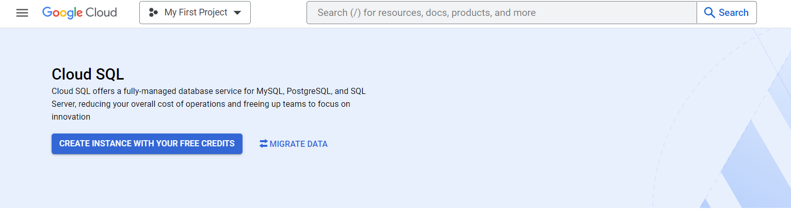
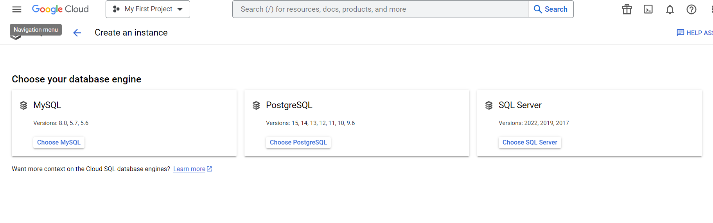
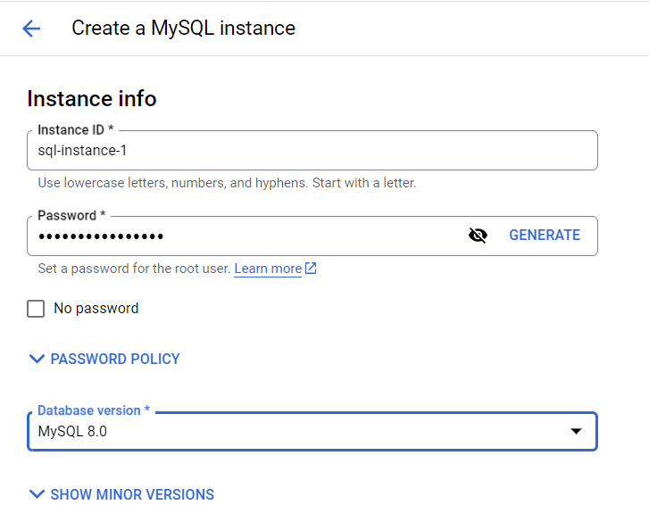
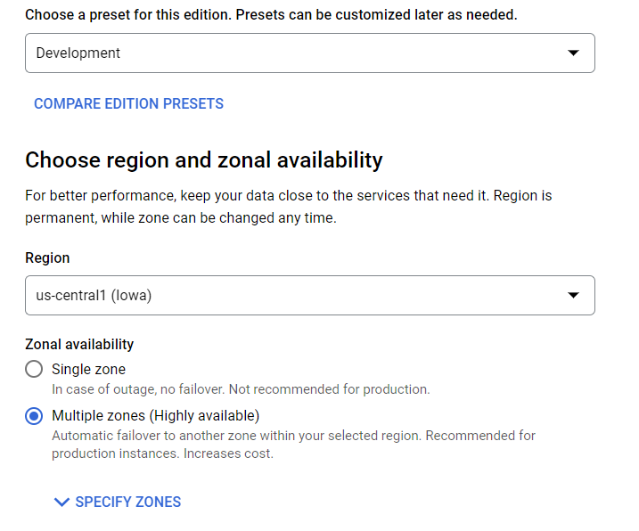

# Basics of GCP
GCP stands for Google Cloud Platform. It is a cloud provider by Google. It has various services to meet the demand of various cloud workloads.

When coming form other cloud providers we might find it difficult to get readjusted.Here is a chart of equivalent services list in aws, azure, gcp.


To start with GCP we need understand the main workspace we will work in when using GCP. The dashbord. We will spend the most ammount of our time in this dashboard to access various services. So understanding the layout of it very important to work efficiently.

## The Dashboard
`Dashboard` contains a various assortment of panels for our quick access and ease of use. Other panels can be added to it as well.


The red mark point to current project we are working on. All  services will be deployed in this the selected project. The blue marks describes the current project info. The yellow mark shows basic billing info.
Open the current project dropdown. More details can be found by opening detailed views. By opening the red marked dropdown we can see the following floating menu.


This opens a list view of all project. Open specific projects. Currently there is one. By selecting and opening you can change projects.

We can access the `naviagation menu` by clicking the hamburger menu on the top left corner. This menu contains all pinned services and is basically a quick access menu. The pinned service are at top.


Scrolling down to the bootom and selecting `More Products` reveal all products available in gcp. We can also pin new services from there.


Here is a view after opening the `More Products` dropdown.


## Create virtual machines using GCP Compute Engine

GCP Compute Engine service allows for provisioning of vm instances in google cloud. They can provisioned in immutable zones.

### Manual Instance Creation

First of all creating a virtual machine manually follow the steps bellow,
Open virtual machine submenu in the `GCP Compute Engine` service.

Create a new instance like below. As needed.

The creation process,

Now in the list view selecting `SSH` will ssh to the created instance. Now through the opened browser terminal we can access the created instance and make changes.


### Instance Creation with Cloud Shell

For using cloud shell, 
Select a project if needed using
```
gcloud config set project adept-acronym-395317
```

Here is the confimation,

Create instance using the following command,
```
gcloud compute instances create abir-instance-1 --machine-type e2-micro --zone=us-west4-b
```
Here abir-instance-1 is the instance name, its type is a e2-micro instance and the zone is set to us-west4-b. Other parameters can also be added.

To connect and makes changes to the instance run the following command,

After work with resource is done run the following to delete the resource. 
```
gcloud compute instances delete abir-instance-1 --zone=us-west4-b
```


### Instance Creation with Terraform

Setup a vm instance. Ensure [gcloud cli installed](https://cloud.google.com/sdk/docs/install).
Now [install terraform](https://developer.hashicorp.com/terraform/tutorials/gcp-get-started/install-cli). By running the following codes in [terraform will be installed](https://developer.hashicorp.com/terraform/downloads).
```
wget -O- https://apt.releases.hashicorp.com/gpg | sudo gpg --dearmor -o /usr/share/keyrings/hashicorp-archive-keyring.gpg

echo "deb [signed-by=/usr/share/keyrings/hashicorp-archive-keyring.gpg] https://apt.releases.hashicorp.com $(lsb_release -cs) main" | sudo tee /etc/apt/sources.list.d/hashicorp.list

sudo apt update && sudo apt install terraform
```
To build the the vm on compute engine follow the steps bellow,
1. Make a service account for terraform. Follow the illustrated below.
    

    

    

    

    

    

    

    

    
    Keep the key file in the same directory as the configuration file for this configuration to work.
2. Write configuration file with `*.tf` as extension. This is what it will look like.
    ```
    terraform {
        required_providers {
            google = {
            source = "hashicorp/google"
            version = "4.77.0"
            }
        }
    }

    provider "google" {
        credentials = file("<NAME>.json")

        project = "<PROJECT_ID>"
        region  = "us-west4"
        zone    = "us-west4-b"
    }

    resource "google_compute_instance" "vm_instance" {
        name         = "terraform-instance"
        machine_type = "e2-micro"

        boot_disk {
            initialize_params {
            image = "debian-cloud/debian-11"
            }
        }
          network_interface {
            network = "default"
            access_config {
        }
    }
    ```
    Here `<NAME>` needs to changed to the name of json key file that was downloaded. `<PROJECT_ID>` needs to be changed to the id of the project where you want create your infrastructure.

3. Now run the following to initialize the directory.
    ```
    terraform init
    ```
    
4. Run `terraform fmt` to formt the terraform configuration to be consistent and to ensure configuration is syntactically valid and internally consistent by using the `terraform validate` command. (Optional)
5. To build the infrastructure use the following command.
    ```
    terraform apply
    ```
    
    
    
    Now view the gcloud console to view created infrastructure.
    
6. The infrastructure can be taken down with the following command.
    ```
    terraform destroy
    ```
    

    

## Creating a Cloud SQL instance

Cloud sql is a managed relational database service by GCP. We can create mysql or postgresql or sql server instances.

### Creation of SQL instance using Cloud Console

Before starting ensure Compute Engine API is enabled.

First of open the `Navigation Menu` and select `SQL`. Once the cloud sql landing page opens, select `Create Instance`.



Now select intended `database engine`. We are going to use `MySQL`. So we will select it.



Now name instance, make or generate a strong password and select a database version.



Chose preset depending on needs. This time we are selecting `development`. Select region and ensure if high availability is needed.



If further configuration is needed, do so as needed. Now by selecting `CREATE INSTANCE` the sql service will be provisioned.


### Creation of SQL instance using Cloud Shell

To create `Cloud SQL` instance run the following command in `cloud shell`

```
gcloud sql instances create INSTANCE_NAME \ --root-password=ROOT_PASSWORD \
--availability-type=regional \
--region=REGION \
```

### Connect to SQL instance


## JAVA Spring application connecting with Cloud SQL

This [repo](https://github.com/abir364/lms-project) is the reference java application. 

First of all, a cloud sql instance needs to be created. Then we need create a database and a database user for the application.

Create a IAM service account for cloud sql use by the application. Create a key file and download the key file, `.json`, which will be put in the `src/main/resources` directory.

Enable Cloud SQL Admin API from API & Services.

Then move on the the source code, adding a dependency to the spring application in the `pom.xml` file located in root of the repo. Adding these following lines to ensure the dependency needed for the application to connect with google cloud sql is installed.

```
<dependencies>
    <! other dependencies>
    <dependency>
                <groupId>org.springframework.cloud</groupId>
                <artifactId>spring-cloud-gcp-starter-sql-mysql</artifactId>
                <version>RELEASE</version>
    </dependency>
</dependencies>
```
Now removing the following line as it is not needed.
```
spring.datasource.url = jdbc:mysql://dbServer:3306/dbName?useSSL=true
```
Also by adding these line ensure database connection-
```
spring.cloud.gcp.sql.instance-connection-name= <Connection name>
spring.cloud.gcp.sql.database-name= <DB name>
...
...
# Configure connection pooling if needed
spring.datasource.hikari.maximum-pool-size=10
```
Modify the user and password for database
```
spring.datasource.username = <dbuser>
spring.datasource.password = <dbpass>
```

Modify to use mysql daialect
```
# ==============================================================
# = The SQL dialect makes Hibernate generate better SQL for the chosen database
# ==============================================================
spring.jpa.properties.hibernate.dialect = org.hibernate.dialect.MySQL8Dialect
```
Add service account key file
```
spring.cloud.gcp.credentials.location=classpath:<key-file-name.json>
```
With this the application now can connect with the cloud sql instance.

